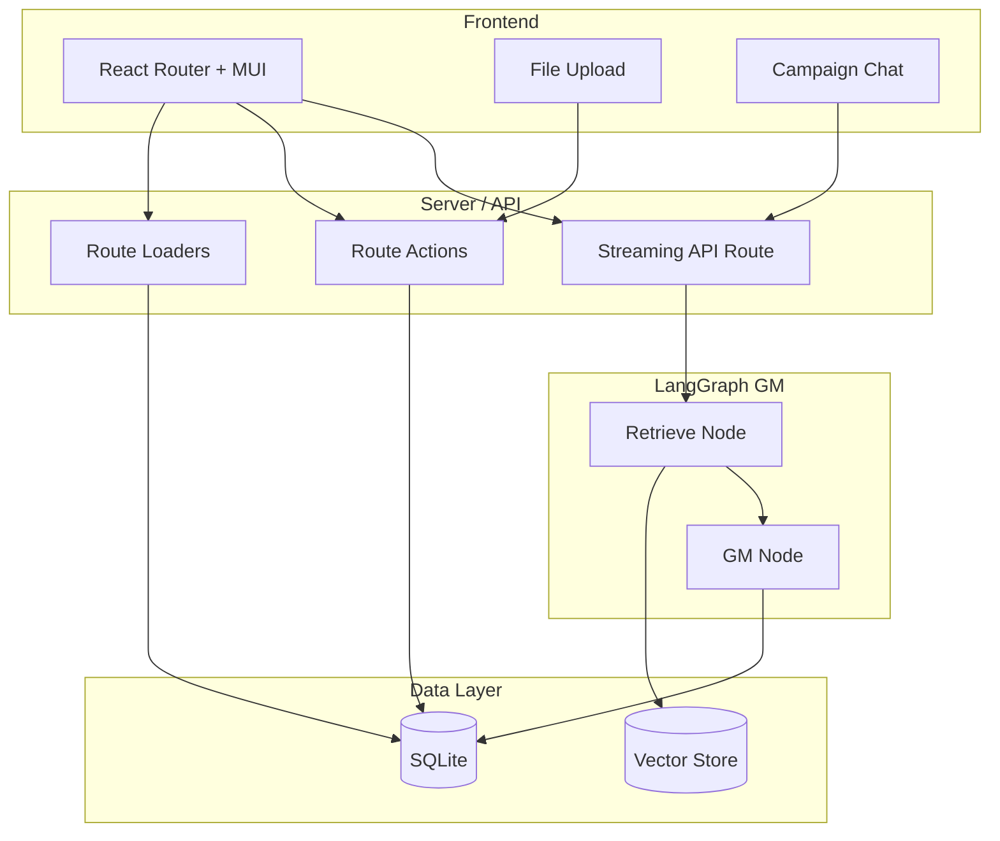

# AI Game Master Web App — Implementation Plan

## Architecture Overview

- **Frontend**: React Router v7 in framework mode, Material UI, CSS Modules. Routes use loaders for data and actions for mutations; one dedicated API route for streaming GM responses.
- **Backend**: Same process (React Router server). SQLite for Users, Rulesets, CampaignTemplates, Campaigns, and messages. Separate vector store for RAG (embeddings + similarity search).
- **RAG**: Ruleset and CampaignTemplate documents are parsed, chunked, embedded, and stored. At message time, retrieve relevant chunks for the active Ruleset and CampaignTemplate and inject into the GM prompt.
- **LangGraph**: Small graph: **retrieve** (RAG) → **gm** (LLM with system prompt + retrieved rules + campaign context + conversation). State holds `messages`; stream `messages` mode for token-by-token UI.

---

## 1. Project Setup

- **Scaffold**: Use `pnpm create react-router@latest` (or equivalent for framework mode) so you get `app/`, `app/routes.ts`, `app/root.tsx`, Vite, and React Router dev server. Use **pnpm** and **TypeScript** throughout.
- **Dependencies** (key ones):
  - React Router: `react-router`, `@react-router/dev`, `@react-router/node` (or `@react-router/vite` per template).
  - UI: `@mui/material`, `@emotion/react`, `@emotion/styled`.
  - Styling: **CSS Modules** only (no Tailwind). Use `*.module.css` next to components.
  - Backend/DB: `better-sqlite3` for SQLite.
  - RAG/LLM: `@langchain/langgraph`, `@langchain/core`, `@langchain/openai` (or `@langchain/anthropic`), and a vector store. For vector store, use:
    - SQLite-based vectors: https://github.com/asg017/sqlite-vec
    - SQLite-based text embedding: https://github.com/asg017/sqlite-rembed
    - This keeps things simple by keeping all data and embeddings in SQLite
  - File parsing: `pdf-parse` or `pdfjs-dist` for PDF; markdown and plain text via `fs`/string handling.
- **Config**: Ensure `react-router.config.ts` and `vite.config.ts` are set for framework mode (server-side loaders/actions). Root layout in `app/root.tsx` with MUI `ThemeProvider` and React Router `Outlet`.

---

## 2. Database Schema (SQLite)

All **non-RAG** persistence in SQLite. RAG can live in the same DB (e.g. chunks + vector column) or a separate vector store; below is the relational schema.

| Table                  | Purpose                                                                                                                                 |
| ---------------------- | --------------------------------------------------------------------------------------------------------------------------------------- |
| **users**              | `id` (PK, uuid), `email`, `name`, `created_at`. Optional: password hash if you add auth.                                                |
| **rulesets**           | `id` (PK, uuid), `user_id` (FK), `name`, `source_file_name`, `created_at`. Optional: `raw_text` or path to stored file for re-chunking. |
| **campaign_templates** | `id` (PK, uuid), `user_id` (FK), `name`, `source_file_name`, `created_at`. Same optional raw/path.                                      |
| **campaigns**          | `id` (PK, uuid), `user_id` (FK), `ruleset_id` (FK), `campaign_template_id` (FK), `title`, `created_at`, `updated_at`.                   |
| **campaign_messages**  | `id` (PK, uuid), `campaign_id` (FK), `role`, `message`                                                                                  |

**RAG storage** (choose one approach):

- **If using a dedicated vector store**: Store only document/chunk references (e.g. `ruleset_id`, `chunk_index`) in metadata; vector store holds embeddings and text. Chunk text can also be duplicated in SQLite in a `ruleset_chunks` / `campaign_template_chunks` table for debugging and re-embedding.
- **If using SQLite for vectors**: Add tables `ruleset_chunks` and `campaign_template_chunks` with `id`, parent `*_id`, `content`, `section_label` (optional), and either a blob for embedding or use an extension like `sqlite-vec` for a proper vector column. Implement similarity search via the extension or a minimal in-memory fallback for dev.

Migrations: use a simple migration runner or raw SQL files (e.g. `migrations/001_initial.sql`) and run them on app start or via a small CLI.

---

## 3. File Upload and Ingestion (Rulesets and Campaign Templates)

- **Upload UX**: Two flows—(1) “Create Ruleset”: upload one file (PDF, Markdown, or plain text). (2) “Create Campaign Template”: upload one or more files; each file can become one CampaignTemplate or you merge into one template per upload (decide product-wise). Use MUI components and CSS Modules for layout. Accept types: `.pdf`, `.md`, `.txt` (and optionally `.markdown`).
- **Server handling**: In a **route action** (e.g. `POST` to a route that handles multipart form data), or a dedicated API route:
  - Validate file type and size.
  - **Parse**:
    - **PDF**: Use `pdf-parse` or `pdfjs-dist` to extract text.
    - **Markdown / plain text**: Read as UTF-8 string.
  - **Chunk**: Prefer section-aware chunking (split on `#` headers for Markdown, or on double newlines) with a max token/chars per chunk (e.g. 500–800 tokens) and optional overlap. Store a `section_label` (e.g. heading) per chunk for better retrieval metadata.
  - **Embed**: Use one embedding model (e.g. OpenAI `text-embedding-3-small`) for all chunks. Batch if needed to respect rate limits.
  - **Persist**: Insert `rulesets` or `campaign_templates` row; then insert chunks + embeddings into the chosen vector store (and optionally into `ruleset_chunks` / `campaign_template_chunks` in SQLite). Ensure `user_id` is set from session/context.
- **Idempotency**: Same file name + user could overwrite or create new version; decide whether to support “replace” or only “create new” and document it.

---

## 4. RAG Retrieval

- **At campaign message time**: Given `campaign_id`, load `campaign.ruleset_id` and `campaign.campaign_template_id`. For the **user message** (and optionally last few turns):
  - **Embed** the query (same model as ingestion).
  - **Retrieve**: Query the vector store filtered by `ruleset_id` and by `campaign_template_id` (two separate retrievals or one store with metadata filters). Top-k per source (e.g. top 5 rules chunks, top 5 campaign chunks), then concatenate into “Rules context” and “Campaign context” strings.
- **LangChain**: Use a retriever built from the vector store with metadata filters (e.g. `vectorStore.asRetriever({ filter: { ruleset_id: "..." } })`). Pass these context strings into the GM node.

---

## 5. LangGraph Game Master Graph (TypeScript)

- **State**: Use `StateSchema` with `messages: MessagesValue` (and optionally `campaignId`, `rulesetId`, `campaignTemplateId` for retrieval). Reducer for `messages` should append.
- **Nodes**:
  1. **retrieve**: Input: last user message (and maybe recent messages). Output: `rulesContext: string`, `campaignContext: string`. Use the retrieval logic above (embed query, query vector store by ruleset_id and campaign_template_id, format chunks).
  2. **gm**: Input: state with `messages` + `rulesContext` + `campaignContext`. Build a **system message**: “You are the Game Master. Apply these rules: …” + rulesContext + “Use this world and story: …” + campaignContext + “Respond to the player and resolve their action.” Then invoke the chat model with `[systemMessage, ...state.messages]`. Return new AI message appended to state.
- **Graph**: `START → retrieve → gm → END`. No tools required for MVP; optional later (e.g. dice, lookup).
- **Compilation**: `StateGraph(State).addNode("retrieve", retrieveNode).addNode("gm", gmNode).addEdge(START, "retrieve").addEdge("retrieve", "gm").addEdge("gm", END).compile()`.
- **Streaming**: Use `graph.stream(inputs, { streamMode: "messages" })` and, in the API route, forward token stream to the client (e.g. `ReadableStream` or SSE). Persist the full assistant message to `campaign_messages` after the stream completes.

---

## 6. API Route for Sending Messages and Streaming GM Response

- **Route**: e.g. `POST /api/campaigns/:campaignId/messages` or a resource route that accepts JSON body `{ content: string }`.
- **Flow**:
  1. Resolve campaign by `campaignId` and ensure it belongs to the current user. Load `ruleset_id` and `campaign_template_id`.
  2. Load full message history for the campaign from `campaign_messages`, convert to LangChain message format.
  3. Append the new user message; persist it to `campaign_messages`.
  4. Invoke the LangGraph graph with state `{ messages }` and config that includes `campaignId`, `rulesetId`, `campaignTemplateId` (or pass them in state) so the retrieve node can run RAG.
  5. Stream the graph with `streamMode: "messages"`. Pipe the stream to the HTTP response (e.g. `ReadableStream` or SSE). On the client, consume the stream and append tokens to the UI.
  6. When stream ends, take the full assistant reply from the graph final state and insert one row into `campaign_messages` (role `assistant`, content = full text).
- **Error handling**: Return 4xx/5xx with a clear body; on client show a toast or inline error.

---

## 7. Frontend Structure (React Router + MUI + CSS Modules)

- **Routes** (in `app/routes.ts`):
  - `/` — Home (list campaigns, links to rulesets and templates).
  - `/rulesets` — List rulesets; “New Ruleset” → upload.
  - `/rulesets/:id` — Ruleset detail (optional: show chunk count, re-process).
  - `/templates` — List campaign templates; “New Template” → upload.
  - `/templates/:id` — Template detail.
  - `/campaigns` — List campaigns; “New Campaign” → select Ruleset + Template, set title.
  - `/campaigns/:id` — **Campaign chat**: left sidebar (optional) or top bar with campaign title, ruleset/template names; main area = message list + input; stream tokens into the latest assistant message.
- **Data**: Use **loaders** for list and detail pages (read from SQLite in loaders). Use **actions** for: create ruleset/template (upload), create campaign, and optionally delete. Use **fetch** (or `useFetcher`) to `POST /api/campaigns/:campaignId/messages` and consume the stream for sending a message.
- **Styling**: One CSS Module per route or component (e.g. `CampaignChat.module.css`). Use MUI for components (Button, TextField, Card, List, AppBar, etc.) and override or compose with class names from CSS Modules where needed. **Do not use Tailwind.**

---

## 8. Campaign Chat UI (Detail)

- **Layout**: MUI `Box`/`Paper` for message list; sticky input at bottom. Message bubbles: user vs assistant; assistant messages support streaming (append tokens to the last message until stream ends).
- **State**: When user submits: (1) Optimistically append user message to UI, (2) POST to streaming endpoint, (3) Create a placeholder assistant message and append streamed tokens to it, (4) On stream end, replace placeholder with final message (and optionally refetch from server to sync with DB).
- **Accessibility**: Focus management, aria-labels for input and send button.

---

## 9. Authentication and Multi-User (Minimal)

- **User**: At least one row in `users`. For MVP, either single-user (one default user) or simple session auth (e.g. cookie with `user_id`). All loaders/actions and the streaming API must resolve `user_id` and filter rulesets, templates, and campaigns by it.
- **Middleware**: Optional React Router **middleware** to require auth and set `context.user` for loaders/actions. If no auth, use a fixed `user_id` in dev.

---

## 10. Key Files to Add (Suggested)

| Area      | Files                                                                                                                             |
| --------- | --------------------------------------------------------------------------------------------------------------------------------- |
| DB        | `server/db/schema.sql`, `server/db/index.ts` (connection + query helpers), `server/db/migrations.ts`                              |
| RAG       | `server/rag/embed.ts`, `server/rag/chunk.ts`, `server/rag/vectorStore.ts` (or Chroma client), `server/rag/retrieve.ts`            |
| LangGraph | `server/gm/graph.ts` (state + nodes + compile), `server/gm/nodes/retrieve.ts`, `server/gm/nodes/gm.ts`                            |
| API       | `app/routes/api.campaigns.$campaignId.messages.ts` (or similar) — POST handler that runs graph and streams                        |
| Upload    | `app/routes/rulesets.new.tsx` (action: parse, chunk, embed, save), `app/routes/templates.new.tsx`                                 |
| Chat      | `app/routes/campaigns.$id.tsx` (loader: campaign + messages), `app/components/CampaignChat.tsx`, `app/components/MessageList.tsx` |
| Styles    | `app/components/*.module.css` next to components                                                                                  |

---

## 11. Environment and Secrets

- **Env**: `DATABASE_PATH` (SQLite file), `OPENAI_API_KEY` (or `ANTHROPIC_API_KEY`), and if using Chroma, `CHROMA_URL` / auth. No secrets in repo; use `.env` and document in README.

---

## 12. Optional Enhancements (Post-MVP)

- **Tools in LangGraph**: e.g. “roll dice” (random number), “look up rule” (targeted RAG). Add a tool-calling node and conditional edge from GM.
- **Re-ingestion**: Replace or re-chunk a ruleset/template and re-embed (e.g. button “Reprocess”).
- **Section labels in UI**: Show which rule sections were retrieved for the last reply (debug/transparency).
- **Multiple files per CampaignTemplate**: Merge or tag chunks by source file for retrieval.

---

## Summary

- **Stack**: TypeScript, pnpm, React Router (framework mode), CSS Modules, MUI, LangGraph (TS), SQLite (relational), and a vector store for RAG.
- **Schema**: User → Ruleset, CampaignTemplate; User → Campaign (with ruleset_id, campaign_template_id); Campaign → campaign_messages. Chunks/embeddings in vector store (and optionally in SQLite).
- **Flows**: Upload file → parse → chunk → embed → store; Create campaign → select ruleset + template; Send message → RAG retrieve → LangGraph (retrieve → gm) → stream response → persist.
- **Streaming**: One API route for `POST .../messages` that runs the graph with `streamMode: "messages"` and pipes the token stream to the client; front-end appends tokens to the current assistant message in the UI.
