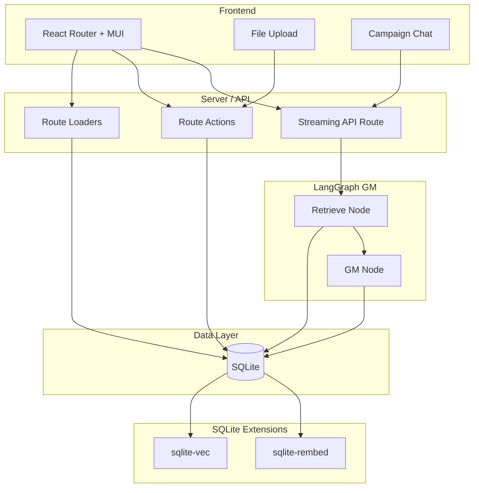

# AI Game Master Web App — Implementation Plan

## Architecture Overview

- **Frontend**: React Router v7 in framework mode, Material UI, CSS Modules. Routes use loaders for data and actions for mutations; one dedicated API route for streaming GM responses.
- **Backend**: Same process (React Router server). **Single SQLite database** for all persistence: relational tables (Users, Rulesets, Worlds, Campaigns, messages) and RAG (chunk text + embeddings via **sqlite-vec** and **sqlite-rembed**).
- **RAG**: Ruleset and World documents are parsed, chunked, embedded with **sqlite-rembed** (or batched in Node for large ingestion), and stored in **sqlite-vec** virtual tables. At message time, the query is embedded with **sqlite-rembed** and similarity search runs in **sqlite-vec**; retrieved chunks are injected into the GM prompt.
- **LangGraph**: Small graph: **retrieve** (RAG via SQLite) → **gm** (LLM with system prompt + retrieved rules + campaign context + conversation). State holds `messages`; stream `messages` mode for token-by-token UI.

---

## 1. Project Setup

- **Scaffold**: Use `npx create-react-router@latest` (or equivalent), then `pnpm install` and pnpm for all scripts. Use **pnpm** and **TypeScript** throughout. You get `app/`, `app/routes.ts`, `app/root.tsx`, Vite, and React Router dev server in framework mode.
- **Dependencies** (key ones):
  - React Router: `react-router`, `@react-router/dev`, `@react-router/node` (or `@react-router/vite` per template).
  - UI: `@mui/material`, `@emotion/react`, `@emotion/styled`.
  - Styling: **CSS Modules** only (no Tailwind). Use `*.module.css` next to components.
  - **Config/validation**: **zod** ([zod.dev](https://zod.dev)) — use as a core dependency to **validate environment variables on app start**. Define a schema (e.g. `envSchema`) for all env vars (required and optional with defaults); parse and validate at server startup and fail fast with clear errors if invalid.
  - Backend/DB: `better-sqlite3` for SQLite; **sqlite-vec** (npm: `sqlite-vec`) and **sqlite-rembed** (load extension from prebuilt binary or [sqlite-dist](https://github.com/asg017/sqlite-dist)).
  - RAG: **sqlite-vec** for vector storage/KNN; **sqlite-rembed** for embeddings. Embedding **client and model** are configured via environment variables (see §11); at app init, register the rembed client in **SQL** with **OpenAI format only** using `rembed_client_options()` (see §11) from env.
  - LLM: `@langchain/langgraph`, `@langchain/core`, and a single chat model integration that supports **OpenAI-compatible** base URL and model name (e.g. `@langchain/openai` with `configuration.baseURL` and `configuration.model` from env). Use this for the GM so the same code works with [LM Studio](https://lmstudio.ai) (default e.g. `http://localhost:1234/v1`), [Ollama](https://ollama.com) (default `http://localhost:11434/v1`), or hosted OpenAI/Anthropic-compatible APIs.
  - File parsing: `pdf-parse` for PDF; markdown and plain text via `fs`/string handling.
- **Config**: Ensure `react-router.config.ts` and `vite.config.ts` are set for framework mode. Root layout in `app/root.tsx` with MUI `ThemeProvider` and React Router `Outlet`. **LLM and embedding provider**: read from env on server startup; **validate env with zod** on app start (see §11); no hardcoded URLs or model names.

---

## 2. Database Schema (SQLite)

**Single SQLite database** for relational data and RAG. Load **sqlite-vec** and **sqlite-rembed** extensions on connection. **Convention**: use **camelCase** for all table and column names (no snake_case). In SQL, use quoted identifiers where needed (e.g. `"userId"`, `"createdAt"`).

**Relational tables:**

| Table                | Purpose                                                                                                                                                                                                                                                                                                                                |
| -------------------- | -------------------------------------------------------------------------------------------------------------------------------------------------------------------------------------------------------------------------------------------------------------------------------------------------------------------------------------- |
| **users**            | `id` (PK, uuid), `email`, `name`, `createdAt`, `updatedAt`. Optional: password hash if you add auth.                                                                                                                                                                                                                                   |
| **rulesets**         | `id` (PK, uuid), `userId` (FK), `name`, `description` (TEXT, optional), `coverImagePath` (TEXT, optional), `createdAt`, `updatedAt`. Source documents are stored in **rulesetSources** (one row per file).                                                                                                                             |
| **worlds**           | `id` (PK, uuid), `userId` (FK), `name`, `description` (TEXT, optional), `coverImagePath` (TEXT, optional), `createdAt`, `updatedAt`. Source documents are stored in **worldSources** (one row per file).                                                                                                                               |
| **rulesetSources**   | `id` (PK, uuid), `rulesetId` (FK), `filePath` (TEXT) — relative path in `uploads/` for re-chunking, `originalFileName` (TEXT) — client filename for display, `sortOrder` (INTEGER, optional) — preserve upload order, `createdAt`. One row per uploaded PDF/MD/TXT file that makes up the ruleset.                                     |
| **worldSources**     | Same shape: `id` (PK, uuid), `worldId` (FK), `filePath` (TEXT), `originalFileName` (TEXT), `sortOrder` (INTEGER, optional), `createdAt`. One row per uploaded source file for the world.                                                                                                                                               |
| **campaigns**        | `id` (PK, uuid), `userId` (FK), `rulesetId` (FK), `worldId` (FK), `name`, `coverImagePath` (TEXT, optional), `createdAt`, `updatedAt`.                                                                                                                                                                                                 |
| **characters**       | `id` (PK, uuid), `campaignId` (FK), `name`, `race`, `class` (or `className` if `class` is reserved), `description` (TEXT), `imagePath` (TEXT, optional), `skills` (TEXT/JSON), `statistics` (TEXT/JSON), `items` (TEXT/JSON), `createdAt`, `updatedAt`. A campaign has one or more characters (the party); all controlled by the user. |
| **campaignMessages** | `id` (PK, uuid), `campaignId` (FK), `role`, `content` (TEXT), `createdAt`, `updatedAt`.                                                                                                                                                                                                                                                |

**Chunk tables** (text only; embeddings live in vec0 virtual tables):

| Table             | Purpose                                                                                                                                                                                                                  |
| ----------------- | ------------------------------------------------------------------------------------------------------------------------------------------------------------------------------------------------------------------------ |
| **rulesetChunks** | `id` (PK, integer, used as rowid for vec table), `rulesetId` (FK), `rulesetSourceId` (FK to rulesetSources) — source file this chunk was generated from, `content` (TEXT), `sectionLabel` (TEXT, optional), `createdAt`. |
| **worldChunks**   | Same shape: `id`, `worldId`, `worldSourceId` (FK to worldSources) — source file this chunk was generated from, `content`, `sectionLabel`, `createdAt`.                                                                   |

**sqlite-vec virtual tables** (store embeddings; use same rowid as chunk tables for joins):

- **vecRulesetChunks**: `create virtual table vecRulesetChunks using vec0(rowid integer primary key, embedding float[1536], rulesetId text)`. The `rulesetId` column is a **metadata column** (no `+` prefix) so it can appear in the KNN `WHERE` clause. Insert with `rowid` = `rulesetChunks.id` so `JOIN rulesetChunks ON rulesetChunks.id = vecRulesetChunks.rowid` works. Retrieval: `WHERE embedding MATCH ? AND rulesetId = ? AND k = ?` (bind query embedding blob, rulesetId, and k).
- **vecWorldChunks**: Same pattern: `rowid integer primary key`, `embedding float[1536]`, `worldId text` (metadata column); rowid = `worldChunks.id`. Retrieval: `WHERE embedding MATCH ? AND worldId = ? AND k = ?`.

Embedding dimension (e.g. 1536 for `text-embedding-3-small`, or model-specific for Ollama) must match the configured embedding model. Define the dimension in env or a config module (e.g. `EMBEDDING_DIMENSION`) and use it when creating vec0 tables so the same code works with different providers.

**sqlite-rembed**: At app init, register the embedding client from **environment variables** (see §11). In **SQL**, use the extension’s `rembed_client_options()` function (snake_case). Always use **OpenAI format**: `rembed_client_options('format', 'openai', 'url', <EMBEDDING_BASE_URL>, 'key', <EMBEDDING_API_KEY>)`. The client name used in `rembed(clientName, ?)` is the configured model identifier (`EMBEDDING_MODEL`). No hardcoded URLs or API keys in code.

**Migrations (run on app start)**:

- **Version tracking**: Use SQLite’s built-in `**user_version**` (starts at 0; SQLite does not use it). Get/set with `PRAGMA user_version;` and `PRAGMA user_version = N;`. On app start, read the current `user_version`, apply any pending migrations to bring the schema up to date, then set `user_version` to the new version.
- **Transaction**: Run each migration (or the whole batch) inside a **transaction**. If any step fails, roll back so no partial changes are committed.
- **Making schema changes**:
  - **When possible, use [ALTER TABLE**](http://www.sqlite.org/lang_altertable.html) for supported operations: **add column** (`ALTER TABLE t ADD COLUMN c ...`) or **rename table** (`ALTER TABLE t RENAME TO t_new`). This updates tables in place.
  - **For unsupported changes** (e.g. drop column, change column type): **create a new table** with the desired schema, **migrate data** from the old table (INSERT ... SELECT), **drop the old table**, then **rename the new table** to the original name.
- **Order**: Load sqlite-vec and sqlite-rembed **before** running migrations that create vec0 virtual tables. Run relational schema migrations first (e.g. version 1 = base tables), then extensions, then vec tables (e.g. version 2 = vecRulesetChunks, vecWorldChunks).
- **Migration files**: Each migration lives in a dedicated file under `server/db/migrations/` with a numeric prefix and descriptive name, e.g. `0001-initial-schema.ts`, `0002-vec-tables.ts`. The prefix is the migration **version** (integer). Use zero-padded prefixes (e.g. `0001`, `0002`) so filenames sort lexicographically in run order.
- **Per-file contract**: Each migration file exports a version number (or it is derived from the filename) and an **up** function that receives the DB connection (and optionally the current `user_version`) and performs the schema changes for that version (e.g. raw SQL or a small script). No **down** required for this plan unless added later.
- **Runner**: A single migration runner (e.g. `server/db/migrate.ts`) that: (1) opens the DB and loads sqlite-vec/sqlite-rembed before any migration that needs them, (2) runs `PRAGMA user_version` to get the current version, (3) **discovers** migration files in `server/db/migrations/` (e.g. glob `*.ts` or `*.js`), (4) parses the version from the filename (or from the exported value), (5) filters to migrations with version > current `user_version`, (6) runs pending migrations **in order** inside a **transaction**, (7) after each successful migration sets `PRAGMA user_version` to that migration’s version. Invoke this runner **on app start** before any other DB access.

**Upload storage (all file uploads):** Use a single root project folder **`uploads/`**. Every saved file is stored as **`uploads/:uuid_:originalFileName`** (e.g. `uploads/f47ac10b-58cc-4372-a567-0e02b2c3d479_manual.pdf` or `uploads/f47ac10b-58cc-4372-a567-0e02b2c3d479_cover.png`). Generate a new UUID per file; keep the client-provided original filename (sanitized if needed). Store the **relative path** (e.g. `uploads/uuid_originalFileName.ext`) in the relevant place: **rulesetSources** or **worldSources** (one row per file, `filePath` + `originalFileName`) for ruleset/world source documents; `coverImagePath` or `imagePath` for cover/character images. Applies to: ruleset/world source documents (many per ruleset/world), ruleset/world/campaign cover images, and character images.

---

## 3. File Upload and Ingestion (Rulesets and Worlds)

**Validation and limits:**

- **File types:** Documents: `.pdf`, `.md`, `.txt`. Images: `.jpg`, `.jpeg`, `.png`, `.webp`. Reject others with 400 and a clear error.
- **File sizes:** Document max e.g. 100 MB per file; cover/character image max e.g. 2–5 MB. Reject with 413 or 400 and clear error message.
- **Filenames:** Sanitize stored filenames (strip path, limit length, avoid control characters, append a UUID); keep original extension and use `:uuid_:originalFileName.ext` in `uploads/`.
- **Env:** All provider URLs and keys validated at startup via zod; fail fast with actionable errors.

- **Upload UX**: Two flows—(1) “Create Ruleset”: upload one or more files (PDF, Markdown, or plain text) to create a single `Ruleset`. (2) “Create World”: upload one or more files (PDF, Markdown, or plain text) to create a single `World`. Use MUI components and CSS Modules for layout. **Name and short description** are **auto-generated** on the server after parse; show them in the UI once ready (e.g. preview or detail page); optionally allow editing before or after save. Accept document types: `.pdf`, `.md`, `.txt`; accept optional **cover image**: `.jpg`, `.jpeg`, `.png`, `.webp`.
- **Server handling**: In a **route action** (e.g. `POST` to a route that handles multipart form data), or a dedicated API route:
  - Validate file types and sizes (documents + optional cover image).
  - **Parse**: PDF via `pdf-parse`; Markdown/plain text as UTF-8 string. Concatenate all uploaded document contents for the entity.
  - **Generate name and description**: From the parsed text (e.g. first 1,000 chars), call the configured LLM with a short prompt asking for a concise **title** (a few words) and a **short description** (1–2 sentences). Use the same OpenAI-compatible client as the GM; keep the prompt small so it's fast. Store results in `name` and `description` on the new row. Fallback: derive a name from the first document's filename or first heading if LLM is unavailable.
  - **Cover image**: If an image file is provided, validate type and size (e.g. max 2–5 MB), save to **`uploads/:uuid_:originalFileName`** (see upload storage convention). Store the relative path in `coverImagePath`. Optionally resize or re-encode for consistent display.
  - For each uploaded source document, save to **`uploads/:uuid_:originalFileName`** and insert a row into **rulesetSources** or **worldSources** with `filePath` (relative), `originalFileName`, and optional `sortOrder`; same convention for all uploads.
  - **Chunk**: Section-aware chunking (split on `#` headers for Markdown, page number or header for PDFs, or double newlines) with max chars per chunk (e.g. 500–800 tokens) and optional overlap. Store `sectionLabel` per chunk.
  - **Embed and persist (SQLite-only RAG)**:
    - Insert `rulesets` or `worlds` row (with `name`, `description`, `coverImagePath`); then for each chunk insert into `rulesetChunks` or `worldChunks` and get `id`.
    - Use **sqlite-rembed** in SQL with the **configured embedding client name** from env (e.g. `rembed(embeddingClientName, ?)`). One HTTP request per chunk; consider a progress indicator or background job for large files.
  - Ensure `userId` is set from session/context.

---

## 3b. Characters (Schema and Flows)

Characters are **playable characters** that make up the **party** for a campaign; each character is linked to a **campaign** and controlled by the user. When starting or managing a campaign, the user creates one or more characters.

**Character fields**: `name`, `race`, `class` (or `className`), `description`, `image` (optional; store path in `imagePath`), `skills`, `statistics`, `items`. Store `skills`, `statistics`, and `items` as structured TEXT/JSON so they can vary by ruleset (e.g. list of skill names, key-value stats, list of item names or objects).

**Suggested / autocomplete values**: Depending on the campaign's **Ruleset** and **World**, the app should provide **suggested, autocomplete values** when the user is creating or editing a character. Use RAG (retrieve from ruleset and world chunks) to derive suggested races, classes, skills, statistics, and inventory items that fit the current campaign. Expose these via an API or loader (e.g. `GET /api/campaigns/:campaignId/character-suggestions` or include in the character form loader) so the UI can drive autocomplete and dropdowns. The UI must **not** be rigid: allow **custom values** for all fields (free text or selection from suggestions).

**Character creation/edit view** — two ways to edit:

1. **Form**: Manually edit all fields with **Material UI** inputs (TextField, Select, Autocomplete, buttons, toggles, etc.). Use suggested values from the campaign's ruleset/world for autocomplete where appropriate; user can still type custom values.
2. **Chat with GM**: A **conversational thread** (similar to the main campaign chat) where the user describes their desired character in natural language. The **GM AI agent** asks follow-up questions as needed to produce a valid character for the current campaign's Ruleset and World. When the AI has enough information, it responds with a **suggested character** (e.g. structured JSON or a clear block). The app **updates the form view** with this suggestion as a **preview**; the user can then tweak fields in the form before saving.

**Flow**: User opens character create/edit → sees form + optional GM chat. They can fill the form only, or use the GM chat to get a suggestion and then edit in the form. When satisfied, user clicks **Submit** → save character (insert or update), add/link to campaign, **redirect to main campaign view**. New characters are created from the campaign context (e.g. "Add character" from campaign view); edit uses the same view with the character loaded.

**Implementation notes**:

- **Character-suggestions**: Retrieve chunks from the campaign's ruleset and world (same RAG as campaign chat); optionally use the LLM to extract or list races, classes, skills, stats, items from retrieved text and return structured options for the form.
- **Character GM chat**: Reuse the same LangGraph GM with a **character-creation mode** (different system prompt: "Help the player create a character; use the following rules and world context…; when ready, respond with a structured character suggestion"). Or a dedicated subgraph that retrieves rules/world context and prompts the LLM to ask follow-ups and then output a suggested character. Stream responses as in campaign chat; when the assistant message contains a character suggestion, parse it (e.g. JSON in a code block) and update the form state. Persist character-chat messages only in memory or in a separate store for the session if needed; the canonical character is saved on Submit.
- **Image**: Optional character image upload; save to **`uploads/:uuid_:originalFileName`** and store the relative path in `imagePath` (same convention as all other uploads).

---

## 4. RAG Retrieval (sqlite-vec + sqlite-rembed)

- **At campaign message time**: Given `campaignId`, load `campaign.rulesetId` and `campaign.worldId`. For the **user message** (and optionally last few turns):
  - **Embed the query** using **sqlite-rembed** in SQL: `SELECT rembed(?, ?)` with the **configured embedding client name** (from env) and the query text; bind the returned blob for the next step (one HTTP call per message).
  - **Retrieve** with **sqlite-vec** (two separate KNN queries; `rulesetId` and `worldId` are **metadata columns** so they can be used in `WHERE`):
    - Rules: `SELECT rowid, distance FROM vecRulesetChunks WHERE embedding MATCH ? AND rulesetId = ? AND k = 5` (bind the query embedding blob and `rulesetId`). Join to `rulesetChunks` on `rowid` to get `content` (and optionally `sectionLabel`).
    - Campaign: `SELECT rowid, distance FROM vecWorldChunks WHERE embedding MATCH ? AND worldId = ? AND k = 5`; join to `worldChunks` for `content`.
  - Concatenate chunk contents into “Rules context” and “Campaign context” strings for the GM prompt.
- **Retrieve node**: In the LangGraph retrieve node, run the above SQL (embed query with rembed, then two vec0 queries, then JOIN to chunk tables). No LangChain vector-store abstraction required; keep retrieval as a small function that takes `(queryText, rulesetId, worldId)` and returns `{ rulesContext, campaignContext }`. Pass these strings into the GM node.

---

## 5. LangGraph Game Master Graph (TypeScript)

- **State**: Use `StateSchema` with `messages: MessagesValue` (and optionally `campaignId`, `rulesetId`, `worldId` for retrieval, and `characterReferences?: { characterId, name }[]` for resolved @-mentions). Reducer for `messages` should append.
- **Nodes**:
  1. **retrieve**: Input: last user message (and maybe recent messages). Output: `rulesContext: string`, `campaignContext: string`. Embed query with **sqlite-rembed** using the **configured embedding client name** (from env); run two **sqlite-vec** KNN queries filtered by `rulesetId` and `worldId`; join to chunk tables for content; concatenate into rules and campaign context strings.
  2. **gm**: Input: state with `messages` + `rulesContext` + `campaignContext` and optional `characterReferences` (resolved @-mentions: `{ characterId, name }[]`). Build a **system message** that includes rules and world context; if `characterReferences` exist, add which character IDs map to which @-mentioned names so the GM can use them for context or tool calls. Then: “You are the Game Master. Apply these rules: …” + rulesContext + “Use this world and story: …” + campaignContext + “Respond to the player and resolve their action.” Invoke the **configurable chat model** (base URL, model name, optional API key from env—OpenAI-compatible so [LM Studio](https://lmstudio.ai) and [Ollama](https://ollama.com) work by default). Return new AI message appended to state.
- **Graph**: `START → retrieve → gm → END`. No tools required for MVP; optional later (e.g. dice, lookup).
- **Compilation**: `StateGraph(State).addNode("retrieve", retrieveNode).addNode("gm", gmNode).addEdge(START, "retrieve").addEdge("retrieve", "gm").addEdge("gm", END).compile()`.
- **Streaming**: Use `graph.stream(inputs, { streamMode: "messages" })` and, in the API route, forward token stream to the client (e.g. `ReadableStream` or SSE). Persist the full assistant message to `campaignMessages` after the stream completes.

---

## 6. API Route for Sending Messages and Streaming GM Response

- **Route**: e.g. `POST /api/campaigns/:campaignId/messages` or a resource route that accepts JSON body `{ content: string }` (the message text, which may contain character references like `@CharacterName`).
- **Flow**:
  1. Resolve campaign by `campaignId` and ensure it belongs to the current user. Load `rulesetId`, `worldId`, and the campaign’s **characters** (id and name).
  2. **Resolve character references**: Parse the submitted `content` for patterns like `@CharacterName` (e.g. regex or split on `@` and match following word/phrase). For each match, look up the campaign’s characters by name and map to `characterId`. Build a list of **resolved references** (e.g. `{ characterId, name }[]`). Unresolved @-mentions (no matching character) can be left as-is in the content or flagged; store the content as-is in `campaignMessages`.
  3. Load full message history for the campaign from `campaignMessages`, convert to LangChain message format.
  4. Append the new user message; persist it to `campaignMessages` (role `user`, content = raw text with `@CharacterName`).
  5. Invoke the LangGraph graph with state `{ messages }` and config that includes `campaignId`, `rulesetId`, `worldId` and **resolved character references** (e.g. `characterReferences: { characterId, name }[]`) so the retrieve node and GM node can use them. The GM can receive this as context (e.g. “The player is referring to these characters: …”) to drive the response or future tool calls (e.g. apply effect to characterId).
  6. Stream the graph with `streamMode: "messages"`. Pipe the stream to the HTTP response. **Streaming protocol**: Use **SSE** (Server-Sent Events). For each streamed item from the graph, filter by `metadata.langgraph_node === "gm"` so only GM token deltas are sent. Send each delta as an event, e.g. `event: message`, `data: <json>` (e.g. the message chunk). Send a final event (e.g. `event: done` or `data: {"done": true}`) so the client knows the stream is complete. On the client, parse the SSE stream, append chunk deltas to the current assistant message until the done event; then treat as final and optionally refetch from the server to sync with DB.
  7. When stream ends, take the full assistant reply from the graph final state and insert one row into `campaignMessages` (role `assistant`, content = full text).
- **Error handling**: Return 4xx/5xx with a clear body; on client show a toast or inline error.

---

## 7. Frontend Structure (React Router + MUI + CSS Modules)

- **Routes** (in `app/routes.ts`):
  - `/` — Home (list campaigns, links to rulesets and worlds).
  - `/rulesets` — List rulesets; “New Ruleset” → upload.
  - `/rulesets/:id` — Ruleset detail: show auto-generated name, description, optional cover image; optional chunk count, re-process.
  - `/worlds` — List worlds; “New World” → upload.
  - `/worlds/:id` — World detail: show auto-generated name, description, optional cover image.
  - `/campaigns` — List campaigns; “New Campaign” → select Ruleset + World, set name.
  - `/campaigns/:id` — **Campaign view**: left column = party character summary cards (vertical list); main area = campaign chat (message list + input; stream tokens). Campaign name, ruleset/world names; entry point to add characters, interact with character cards, and use campaign chat.
  - `/campaigns/:id/characters/new` — **Character creation**: form (name, race, class, description, image, skills, statistics, items) with suggested/autocomplete from ruleset and world; optional character GM chat to get AI-suggested character that updates the form. Submit saves character and redirects to campaign view.
  - `/campaigns/:id/characters/:characterId` — **Character edit**: same as creation with character loaded; form + optional character GM chat; Submit updates and redirects to campaign view.
- **Data**: Use **loaders** for list and detail pages (read from SQLite: include `name`, `description`, `coverImagePath` for rulesets, worlds, and campaigns). Use **actions** for: create ruleset/world (upload documents + optional cover image; server returns or redirects with auto-generated name/description). List views show name, short description, and cover thumbnail where present. Use **fetch** for: campaign chat stream (`POST .../messages`), character GM chat stream (e.g. `POST .../characters/chat`), and character-suggestions (loader or `GET .../character-suggestions`). Loaders for campaign view include campaign + characters + messages; for character form include suggested values from ruleset/world. Actions: create/update character (form submit).
- **Styling**: One CSS Module per route or component (e.g. `CampaignChat.module.css`). Use MUI for components (Button, TextField, Card, List, AppBar, etc.) and override or compose with class names from CSS Modules where needed. **Do not use Tailwind.**

---

## 8. Campaign Chat UI (Detail)

- **Layout**: **Primary campaign layout** has two main regions: (1) **Left column** — a vertical list of **party character summary cards** (one card per character). (2) **Main area** — campaign chat: message list (MUI `Box`/`Paper`) and sticky input at bottom. Message bubbles: user vs assistant; assistant messages support streaming (append tokens to the last message until stream ends).
- **Character summary cards** (left column): Each card displays the character’s **name**, **image** (if present), **race**, **class**, and **important statistics** (e.g. health, initiative) — the exact stats shown depend on the campaign’s selected **Ruleset** (e.g. derive from ruleset chunks or a convention like “health”, “initiative”). Cards are compact summary views. **Two primary interactions**:
  1. **Click to add @-mention**: On card click, insert `@CharacterName` at the **current caret/cursor position** in the chat textarea (or **append** to the end of the current text if the textarea is not focused). This provides a quick way to reference a character without typing `@` and using the autocomplete.
  2. **Click to view details**: On a separate action (e.g. secondary click, or a “details” control on the card), open a **drawer** that shows **full character details** (skills, inventory, statistics, description, etc.). The drawer can be dismissible and does not navigate away from the campaign view.
- **Character @-mentions** (textarea): When the user types `**@**` in the campaign chat input, show an **autocomplete popover** listing all **characters** belonging to the current campaign (from loader data). On selection, insert the character reference into the text (e.g. `@CharacterName`). The composed message can look like: _"Give `@CharacterName` a health potion"_. Display mentions in the textarea as plain text `@CharacterName` (or with subtle styling). On submit, send the message content as-is; the backend resolves `@CharacterName` to `characterId` and passes that context to the AI.
- **State**: When user submits: (1) Optimistically append user message to UI, (2) POST to streaming endpoint (body: message content, optionally structured character refs if pre-resolved on client), (3) Create a placeholder assistant message and consume the **SSE** stream from the API (§6): append chunk deltas to the placeholder until the done event, (4) On stream end, treat as final and optionally refetch from server to sync with DB.
- **Accessibility**: Focus management, aria-labels for input and send button; ensure @-mention popover and character cards (including “add mention” vs “view details”) are keyboard-navigable and announced.

---

## 9. Authentication and Multi-User (Minimal)

- **User**: At least one row in `users`. For MVP, either single-user (one default user) or simple session auth (e.g. cookie with `userId`). All loaders/actions and the streaming API must resolve `userId` and filter rulesets, worlds, and campaigns by it.
- **Middleware**: Optional React Router **middleware** to require auth and set `context.user` for loaders/actions. If no auth, use a fixed `userId` in dev.

---

## 10. Key Files to Add (Suggested)

| Area       | Files                                                                                                                                                                                                                                                                                                                                                                                                                                                                                                                                                                                                               |
| ---------- | ------------------------------------------------------------------------------------------------------------------------------------------------------------------------------------------------------------------------------------------------------------------------------------------------------------------------------------------------------------------------------------------------------------------------------------------------------------------------------------------------------------------------------------------------------------------------------------------------------------------- |
| Config     | `server/config/env.ts` — zod schema for all env vars; validate on app start; export typed config. Optionally `server/config/llm.ts` and `server/config/embedding.ts` that consume validated env and export base URL, model name, API key, embedding client name, dimension, and rembed registration options. No defaults hardcoded in business logic.                                                                                                                                                                                                                                                               |
| DB         | `server/db/index.ts` (connection, load extensions, **run migrations on app start**). `server/db/migrate.ts`: migration runner that discovers migration files in `server/db/migrations/` (e.g. `0001-initial-schema.ts`, `0002-vec-tables.ts`), reads `PRAGMA user_version`, applies pending migrations in version order in a transaction, then sets `user_version`. Each migration file exports an **up** function (and optionally its version). Load sqlite-vec and sqlite-rembed before migrations that create vec0 tables.                                                                                       |
| RAG        | `server/rag/chunk.ts` (section-aware chunking), `server/rag/retrieve.ts` (embed query via rembed + sqlite-vec KNN + join chunk tables; use config for client name). `server/db/vec.ts` (load sqlite-vec + sqlite-rembed, register rembed client from config, create vec0 tables with config dimension, insert/query helpers). Optional: `server/rag/embed.ts` if using Node batch embedding for ingestion.                                                                                                                                                                                                          |
| LangGraph  | `server/gm/graph.ts` (state + nodes + compile), `server/gm/nodes/retrieve.ts`, `server/gm/nodes/gm.ts`                                                                                                                                                                                                                                                                                                                                                                                                                                                                                                              |
| API        | `app/routes/api.campaigns.$campaignId.messages.ts` (POST: campaign chat, stream). Optional: `api.campaigns.$campaignId.characters.chat.ts` (POST: character-creation GM chat, stream) and `api.campaigns.$campaignId.character-suggestions.ts` (GET: suggested races, classes, skills, stats, items from RAG) or fold suggestions into character form loader.                                                                                                                                                                                                                                                       |
| Upload     | `app/routes/rulesets.new.tsx` (action: parse, chunk, embed, save), `app/routes/worlds.new.tsx`. All upload handling uses the project root folder **`uploads/`** and the **`uploads/:uuid_:originalFileName`** convention (shared helper or consistent logic in ruleset/world/character actions).                                                                                                                                                                                                                                                                                                                    |
| Chat       | `app/routes/campaigns.$id.tsx` (loader: campaign + characters + messages), `app/components/CampaignChat.tsx`, `app/components/MessageList.tsx`. **Left column**: Party character summary cards (vertical list: name, image, race, class, ruleset-dependent stats; click card to insert @-mention at cursor or append; click to open character details drawer). **Drawer**: MUI Drawer for full character details (skills, inventory, statistics). **@-mentions**: input component that detects `@`, shows MUI Autocomplete/Popover with campaign characters, inserts `@CharacterName`; characters list from loader. |
| Characters | `app/routes/campaigns.$id.characters.new.tsx`, `app/routes/campaigns.$id.characters.$characterId.tsx` (create/edit). `app/components/CharacterForm.tsx` (MUI form with autocomplete/suggestions), `app/components/CharacterCreationChat.tsx` (GM chat thread for character suggestion; on suggested character, update form preview). Optional: `server/gm/characterGraph.ts` or mode in main graph for character-creation GM.                                                                                                                                                                                       |
| Styles     | `app/components/*.module.css` next to components                                                                                                                                                                                                                                                                                                                                                                                                                                                                                                                                                                    |

---

## 11. Environment and Secrets (Configurable LLM and Embeddings)

All LLM and embedding behavior MUST be driven by environment variables. No hardcoded API URLs, model names, or provider logic. Defaults should support **local** [LM Studio](https://lmstudio.ai) and [Ollama](https://ollama.com) (OpenAI-compatible endpoints). **Validate all env on app start** using **zod**: define a single env schema (e.g. in `server/config/env.ts`) that parses and validates required/optional vars; call it before opening DB or registering rembed so the process fails fast with clear validation errors if env is missing or invalid.

**Database**

| Variable                | Purpose                                                             | Example            |
| ----------------------- | ------------------------------------------------------------------- | ------------------ |
| `DATABASE_PATH`         | SQLite file path                                                    | `./data/gm.sqlite` |
| `REMBED_EXTENSION_PATH` | Path to sqlite-rembed extension binary (optional if on system path) | `./ext/rembed0`    |

**LLM (chat model for GM)**  
Use a single OpenAI-compatible client (e.g. LangChain `ChatOpenAI` with `baseURL` and `model`). Read from env:

| Variable       | Purpose                                            | Default (local)                                                                | Example (hosted)            |
| -------------- | -------------------------------------------------- | ------------------------------------------------------------------------------ | --------------------------- |
| `LLM_BASE_URL` | OpenAI-compatible API base URL (no trailing slash) | `http://localhost:1234/v1` (LM Studio) or `http://localhost:11434/v1` (Ollama) | `https://api.openai.com/v1` |
| `LLM_MODEL`    | Model name                                         | `llama3.2` (Ollama) or whatever is loaded in LM Studio, e.g. `local-model`     | `gpt-4o`                    |
| `LLM_API_KEY`  | API key (optional for local LM Studio/Ollama)      | (empty)                                                                        | `sk-...`                    |

Implementation: one config module (e.g. `server/config/llm.ts`) that reads these and returns options for the chat model constructor. Default `LLM_BASE_URL` can be chosen by convention (e.g. prefer LM Studio port 1234 if nothing set) or document both in README and require the user to set one.

**Embeddings (sqlite-rembed)**  
Register the rembed client at app init from env. In **SQL**, use the extension’s `rembed_client_options()` function. Always use OpenAI-standard format (no provider branching): register with `rembed_client_options('format', 'openai', 'url', EMBEDDING_BASE_URL, 'key', EMBEDDING_API_KEY)`.

| Variable              | Purpose                                   | Default (local)                          | Example (hosted)            |
| --------------------- | ----------------------------------------- | ---------------------------------------- | --------------------------- |
| `EMBEDDING_MODEL`     | Model name (rembed client identifier)     | `text-embedding-embeddinggemma-300m-qat` | `text-embedding-3-small`    |
| `EMBEDDING_BASE_URL`  | OpenAI-compatible embeddings API base URL | `http://localhost:1234/v1` (LM Studio)   | `https://api.openai.com/v1` |
| `EMBEDDING_API_KEY`   | API key (optional for local endpoints)    | (empty)                                  | `sk-...`                    |
| `EMBEDDING_DIMENSION` | Vector size for vec0 schema               | `1536`                                   | `1536`                      |

Implementation: at DB/rembed init, register the client with `INSERT INTO temp.rembed_clients(name, options) VALUES (EMBEDDING_MODEL, rembed_client_options('format', 'openai', 'url', EMBEDDING_BASE_URL, 'key', EMBEDDING_API_KEY))`. Use `EMBEDDING_MODEL` as the client name in `rembed(EMBEDDING_MODEL, ?)`. Create vec0 tables with `float[EMBEDDING_DIMENSION]`.

**Documentation**: Provide an `.env.example` with the above variables and short comments. README should describe using any OpenAI-compatible embeddings endpoint (LM Studio, OpenAI, or other) via `EMBEDDING_BASE_URL` and `EMBEDDING_API_KEY`. No secrets in repo; use `.env` (gitignored) and document in README.

---

## 12. Optional Enhancements (Post-MVP)

- **Tools in LangGraph**: e.g. “roll dice” (random number), “look up rule” (targeted RAG). Add a tool-calling node and conditional edge from GM.
- **Re-ingestion**: Replace or re-chunk a ruleset/world and re-embed (e.g. button “Reprocess”).
- **Section labels in UI**: Show which rule sections were retrieved for the last reply (debug/transparency).
- **AI image generation**: Generate images with AI based on descriptions for: ruleset covers, world covers, characters,
- **Multiple files per World**: Merge or tag chunks by source file for retrieval.

---

## Implementation Phases

Recommended build order with clear dependencies:

- **Phase 1 – Foundation:** Project scaffold (React Router framework mode, pnpm, TypeScript), zod env validation, SQLite + extensions (sqlite-vec, sqlite-rembed) load and rembed client registration, migrations (relational schema then vec0 tables with **metadata** columns for rulesetId/worldId), uploads folder and `uploads/:uuid_:originalFileName` convention. Single default user or minimal session so all later work is scoped by userId.
- **Phase 2 – Rulesets and worlds:** Upload flow (PDF/MD/TXT + optional cover), parse, section-aware chunking, embed via rembed and insert into chunk tables + vec0 tables, LLM-generated name/description (with fallback). List and detail routes for rulesets and worlds.
- **Phase 3 – Campaigns and RAG retrieval:** Campaign CRUD (select ruleset + world), campaign detail loader. Implement retrieval function: embed query with rembed, two vec0 KNN queries (rules + world) filtered by metadata, join to chunk tables, return `rulesContext` and `campaignContext`.
- **Phase 4 – LangGraph GM and streaming API:** State and nodes (retrieve → gm), compile graph, configurable chat model from env. API route: load campaign + history, resolve @-mentions, run graph with `streamMode: "messages"`, pipe stream to response (SSE), persist final assistant message to `campaignMessages`.
- **Phase 5 – Campaign chat UI:** Campaign view layout (character cards left, chat right), message list with streaming, input with @-mention autocomplete and “click card to insert @”, character detail drawer. Optimistic send and token-by-token append.
- **Phase 6 – Characters:** Schema and migrations for characters, character suggestions API/loader (RAG + optional LLM), character create/edit form with suggestions and optional character-creation GM chat, character summary cards and drawer on campaign view. Image upload for characters using same uploads convention.

Optional later: tools (dice, lookup), re-ingestion, section labels in UI, AI image generation.

**Testing (optional):** Unit tests for chunking (section boundaries, overlap), retrieval (mock DB with fixed embeddings), and env validation (valid/invalid env). E2E or integration tests for upload → list and send message → stream response can be added later.

---

## Summary

- **Stack**: TypeScript, pnpm, React Router (framework mode), CSS Modules, MUI, LangGraph (TS), **single SQLite** for all data: relational tables + **sqlite-vec** (vectors/KNN) + **sqlite-rembed** (text embeddings).
- **Schema**: User → Ruleset, World; User → Campaign (with rulesetId, worldId); Campaign → **characters** (party) and campaignMessages. Chunk text in `rulesetChunks` / `worldChunks`; embeddings in **sqlite-vec** virtual tables (dimension from `EMBEDDING_DIMENSION`). Query embedding via **sqlite-rembed** with client name and OpenAI-format url/key from env.
- **Configurable providers**: LLM and embeddings are fully configurable via env (§11). Defaults target local OpenAI-compatible servers: [LM Studio](https://lmstudio.ai) and [Ollama](https://ollama.com).
- **Flows**: Upload file → parse → chunk → embed (rembed in SQL or batched in Node) → insert into chunk tables + vec0 tables; Create campaign → select ruleset + world; Send message → embed query (rembed) → sqlite-vec KNN → join chunks → LangGraph (retrieve → gm) → stream response → persist.
- **Streaming**: One API route for `POST .../messages` that runs the graph with `streamMode: "messages"` and pipes the token stream to the client via **SSE**; server sends GM token deltas and a final `done` event; front-end appends tokens to the current assistant message until done.
