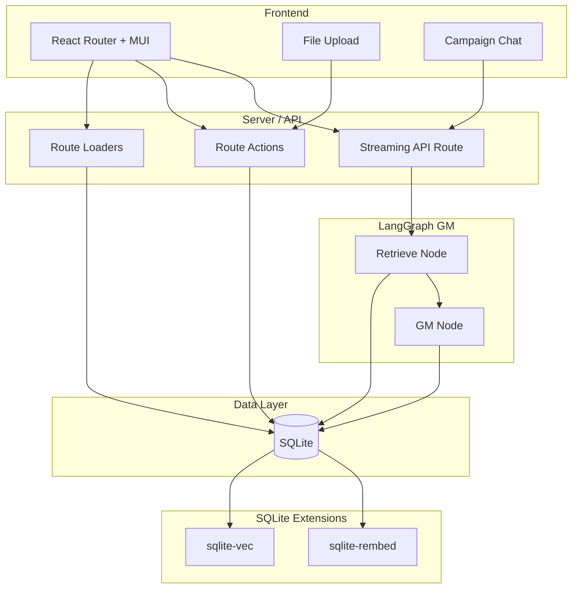

# AI Game Master Web App — Implementation Plan

## Architecture Overview

- **Frontend**: React Router v7 in framework mode, Material UI, CSS Modules. Routes use loaders for data and actions for mutations; one dedicated API route for streaming GM responses.
- **Backend**: Same process (React Router server). **Single SQLite database** for all persistence: relational tables (Users, Rulesets, Worlds, Campaigns, messages) and RAG (chunk text + embeddings via **sqlite-vec** and **sqlite-rembed**).
- **RAG**: Ruleset and World documents are parsed, chunked, embedded with **sqlite-rembed** (or batched in Node for large ingestion), and stored in **sqlite-vec** virtual tables. At message time, the query is embedded with **sqlite-rembed** and similarity search runs in **sqlite-vec**; retrieved chunks are injected into the GM prompt.
- **LangGraph**: Small graph: **retrieve** (RAG via SQLite) → **gm** (LLM with system prompt + retrieved rules + campaign context + conversation). State holds `messages`; stream `messages` mode for token-by-token UI.

---

## 1. Project Setup

- **Scaffold**: Use `pnpm create react-router@latest` (or equivalent for framework mode) so you get `app/`, `app/routes.ts`, `app/root.tsx`, Vite, and React Router dev server. Use **pnpm** and **TypeScript** throughout.
- **Dependencies** (key ones):
  - React Router: `react-router`, `@react-router/dev`, `@react-router/node` (or `@react-router/vite` per template).
  - UI: `@mui/material`, `@emotion/react`, `@emotion/styled`.
  - Styling: **CSS Modules** only (no Tailwind). Use `*.module.css` next to components.
  - Backend/DB: `better-sqlite3` for SQLite; **sqlite-vec** (npm: `sqlite-vec`) and **sqlite-rembed** (load extension from prebuilt binary or [sqlite-dist](https://github.com/asg017/sqlite-dist)).
  - RAG: **sqlite-vec** for vector storage/KNN; **sqlite-rembed** for embeddings. Embedding **client and model** are configured via environment variables (see §11); at app init, register the rembed client from env (e.g. OpenAI-format URL for LM Studio, or built-in `ollama` for [Ollama](https://ollama.com)).
  - LLM: `@langchain/langgraph`, `@langchain/core`, and a single chat model integration that supports **OpenAI-compatible** base URL and model name (e.g. `@langchain/openai` with `configuration.baseURL` and `configuration.model` from env). Use this for the GM so the same code works with [LM Studio](https://lmstudio.ai) (default e.g. `http://localhost:1234/v1`), [Ollama](https://ollama.com) (default `http://localhost:11434/v1`), or hosted OpenAI/Anthropic-compatible APIs.
  - File parsing: `pdf-parse` for PDF; markdown and plain text via `fs`/string handling.
- **Config**: Ensure `react-router.config.ts` and `vite.config.ts` are set for framework mode. Root layout in `app/root.tsx` with MUI `ThemeProvider` and React Router `Outlet`. **LLM and embedding provider**: read from env on server startup; no hardcoded URLs or model names (see §11).

---

## 2. Database Schema (SQLite)

**Single SQLite database** for relational data and RAG. Load **sqlite-vec** and **sqlite-rembed** extensions on connection.

**Relational tables:**

| Table                 | Purpose                                                                                                                                               |
| --------------------- | ----------------------------------------------------------------------------------------------------------------------------------------------------- |
| **users**             | `id` (PK, uuid), `email`, `name`, `created_at`, `updated_at`. Optional: password hash if you add auth.                                                |
| **rulesets**          | `id` (PK, uuid), `user_id` (FK), `name`, `source_file_name`, `created_at`, `updated_at`. Optional: `raw_text` or path to stored file for re-chunking. |
| **worlds**            | `id` (PK, uuid), `user_id` (FK), `name`, `source_file_name`, `created_at`, `updated_at`. Same optional raw/path.                                      |
| **campaigns**         | `id` (PK, uuid), `user_id` (FK), `ruleset_id` (FK), `world_id` (FK), `title`, `created_at`, `updated_at`.                                             |
| **campaign_messages** | `id` (PK, uuid), `campaign_id` (FK), `role`, `content` (TEXT), `created_at`, `updated_at`.                                                            |

**Chunk tables** (text only; embeddings live in vec0 virtual tables):

| Table              | Purpose                                                                                                                               |
| ------------------ | ------------------------------------------------------------------------------------------------------------------------------------- |
| **ruleset_chunks** | `id` (PK, integer, used as rowid for vec table), `ruleset_id` (FK), `content` (TEXT), `section_label` (TEXT, optional), `created_at`. |
| **world_chunks**   | Same shape: `id`, `world_id`, `content`, `section_label`, `created_at`.                                                               |

**sqlite-vec virtual tables** (store embeddings; use same rowid as chunk tables for joins):

- **vec_ruleset_chunks**: `create virtual table vec_ruleset_chunks using vec0(embedding float[1536], ruleset_id text)`. Insert with `rowid` = `ruleset_chunks.id` so `JOIN ruleset_chunks ON ruleset_chunks.id = vec_ruleset_chunks.rowid` works. Use **auxiliary column** `ruleset_id` so retrieval can filter: `WHERE embedding MATCH ? AND ruleset_id = ? ORDER BY distance LIMIT k`.
- **vec_world_chunks**: Same pattern with `embedding float[1536]`, `world_id text`; rowid = `world_chunks.id`.

Embedding dimension (e.g. 1536 for `text-embedding-3-small`, or model-specific for Ollama) must match the configured embedding model. Define the dimension in env or a config module (e.g. `EMBEDDING_DIMENSION`) and use it when creating vec0 tables so the same code works with different providers.

**sqlite-rembed**: At app init, register the embedding client from **environment variables** (see §11). Examples: OpenAI-format (for LM Studio or OpenAI) via custom URL; or built-in `ollama` for Ollama (`http://localhost:11434/api/embeddings`). The client name used in `rembed(client_name, ?)` should be the configured model identifier (e.g. `nomic-embed-text` for Ollama, or a custom name for the registered client). No hardcoded client names or API keys in code.

Migrations: use a simple migration runner or raw SQL files (e.g. `migrations/001_initial.sql`, `002_vec_tables.sql`) and run them on app start or via a small CLI. Load sqlite-vec and sqlite-rembed before creating vec0 virtual tables.

---

## 3. File Upload and Ingestion (Rulesets and Worlds)

- **Upload UX**: Two flows—(1) “Create Ruleset”: upload one or more files (PDF, Markdown, or plain text) to merge into a single `Ruleset`. (2) “Create World”: upload one or more files (PDF, Markdown, or plain text) to merge into a single `World`. Use MUI components and CSS Modules for layout. Accept types: `.pdf`, `.md`, `.txt` (and optionally `.markdown`).
- **Server handling**: In a **route action** (e.g. `POST` to a route that handles multipart form data), or a dedicated API route:
  - Validate file type and size.
  - **Parse**: PDF via `pdf-parse`; Markdown/plain text as UTF-8 string.
  - **Chunk**: Section-aware chunking (split on `#` headers for Markdown, or double newlines) with max chars per chunk (e.g. 500–800 tokens) and optional overlap. Store `section_label` per chunk.
  - **Embed and persist (SQLite-only RAG)**:
    - Insert `rulesets` or `worlds` row; then for each chunk insert into `ruleset_chunks` or `world_chunks` and get `id`.
    - **Option A (recommended for large docs)**: In Node, call the embedding API in batches (e.g. OpenAI embeddings endpoint), then insert into the corresponding **sqlite-vec** virtual table: `INSERT INTO vec_ruleset_chunks(rowid, ruleset_id, embedding) VALUES (?, ?, ?)` with the chunk id, parent id, and embedding as a blob (same format sqlite-vec expects; use `Float32Array` and pass `.buffer` or equivalent when binding). This avoids N sequential HTTP calls from sqlite-rembed.
    - **Option B (pure SQLite)**: Use **sqlite-rembed** in SQL with the **configured embedding client name** from env (e.g. `rembed(embedding_client_name, ?)`). One HTTP request per chunk; consider a progress indicator or background job for large files.
  - Ensure `user_id` is set from session/context.
- **Idempotency**: Same file name + user could overwrite or create new version; decide whether to support “replace” or only “create new” and document it.

---

## 4. RAG Retrieval (sqlite-vec + sqlite-rembed)

- **At campaign message time**: Given `campaign_id`, load `campaign.ruleset_id` and `campaign.world_id`. For the **user message** (and optionally last few turns):
  - **Embed the query** using **sqlite-rembed** in SQL: `SELECT rembed(?, ?)` with the **configured embedding client name** (from env) and the query text; bind the returned blob for the next step (one HTTP call per message).
  - **Retrieve** with **sqlite-vec** (two separate KNN queries):
    - Rules: `SELECT rowid, distance FROM vec_ruleset_chunks WHERE embedding MATCH ? AND ruleset_id = ? ORDER BY distance LIMIT 5` (bind the query embedding blob and `ruleset_id`). Join to `ruleset_chunks` on `rowid` to get `content` (and optionally `section_label`).
    - Campaign: `SELECT rowid, distance FROM vec_world_chunks WHERE embedding MATCH ? AND world_id = ? ORDER BY distance LIMIT 5`; join to `world_chunks` for `content`.
  - Concatenate chunk contents into “Rules context” and “Campaign context” strings for the GM prompt.
- **Retrieve node**: In the LangGraph retrieve node, run the above SQL (embed query with rembed, then two vec0 queries, then JOIN to chunk tables). No LangChain vector-store abstraction required; keep retrieval as a small function that takes `(queryText, rulesetId, worldId)` and returns `{ rulesContext, campaignContext }`. Pass these strings into the GM node.

---

## 5. LangGraph Game Master Graph (TypeScript)

- **State**: Use `StateSchema` with `messages: MessagesValue` (and optionally `campaignId`, `rulesetId`, `worldId` for retrieval). Reducer for `messages` should append.
- **Nodes**:
  1. **retrieve**: Input: last user message (and maybe recent messages). Output: `rulesContext: string`, `campaignContext: string`. Embed query with **sqlite-rembed** using the **configured embedding client name** (from env); run two **sqlite-vec** KNN queries filtered by `ruleset_id` and `world_id`; join to chunk tables for content; concatenate into rules and campaign context strings.
  2. **gm**: Input: state with `messages` + `rulesContext` + `campaignContext`. Build a **system message**: “You are the Game Master. Apply these rules: …” + rulesContext + “Use this world and story: …” + campaignContext + “Respond to the player and resolve their action.” Invoke the **configurable chat model** (base URL, model name, optional API key from env—OpenAI-compatible so [LM Studio](https://lmstudio.ai) and [Ollama](https://ollama.com) work by default). Return new AI message appended to state.
- **Graph**: `START → retrieve → gm → END`. No tools required for MVP; optional later (e.g. dice, lookup).
- **Compilation**: `StateGraph(State).addNode("retrieve", retrieveNode).addNode("gm", gmNode).addEdge(START, "retrieve").addEdge("retrieve", "gm").addEdge("gm", END).compile()`.
- **Streaming**: Use `graph.stream(inputs, { streamMode: "messages" })` and, in the API route, forward token stream to the client (e.g. `ReadableStream` or SSE). Persist the full assistant message to `campaign_messages` after the stream completes.

---

## 6. API Route for Sending Messages and Streaming GM Response

- **Route**: e.g. `POST /api/campaigns/:campaignId/messages` or a resource route that accepts JSON body `{ content: string }`.
- **Flow**:
  1. Resolve campaign by `campaignId` and ensure it belongs to the current user. Load `ruleset_id` and `world_id`.
  2. Load full message history for the campaign from `campaign_messages`, convert to LangChain message format.
  3. Append the new user message; persist it to `campaign_messages`.
  4. Invoke the LangGraph graph with state `{ messages }` and config that includes `campaignId`, `rulesetId`, `worldId` (or pass them in state) so the retrieve node can run RAG.
  5. Stream the graph with `streamMode: "messages"`. Pipe the stream to the HTTP response (e.g. `ReadableStream` or SSE). On the client, consume the stream and append tokens to the UI.
  6. When stream ends, take the full assistant reply from the graph final state and insert one row into `campaign_messages` (role `assistant`, content = full text).
- **Error handling**: Return 4xx/5xx with a clear body; on client show a toast or inline error.

---

## 7. Frontend Structure (React Router + MUI + CSS Modules)

- **Routes** (in `app/routes.ts`):
  - `/` — Home (list campaigns, links to rulesets and worlds).
  - `/rulesets` — List rulesets; “New Ruleset” → upload.
  - `/rulesets/:id` — Ruleset detail (optional: show chunk count, re-process).
  - `/worlds` — List worlds; “New World” → upload.
  - `/worlds/:id` — World detail.
  - `/campaigns` — List campaigns; “New Campaign” → select Ruleset + World, set title.
  - `/campaigns/:id` — **Campaign chat**: left sidebar (optional) or top bar with campaign title, ruleset/world names; main area = message list + input; stream tokens into the latest assistant message.
- **Data**: Use **loaders** for list and detail pages (read from SQLite in loaders). Use **actions** for: create ruleset/world (upload), create campaign, and optionally delete. Use **fetch** (or `useFetcher`) to `POST /api/campaigns/:campaignId/messages` and consume the stream for sending a message.
- **Styling**: One CSS Module per route or component (e.g. `CampaignChat.module.css`). Use MUI for components (Button, TextField, Card, List, AppBar, etc.) and override or compose with class names from CSS Modules where needed. **Do not use Tailwind.**

---

## 8. Campaign Chat UI (Detail)

- **Layout**: MUI `Box`/`Paper` for message list; sticky input at bottom. Message bubbles: user vs assistant; assistant messages support streaming (append tokens to the last message until stream ends).
- **State**: When user submits: (1) Optimistically append user message to UI, (2) POST to streaming endpoint, (3) Create a placeholder assistant message and append streamed tokens to it, (4) On stream end, replace placeholder with final message (and optionally refetch from server to sync with DB).
- **Accessibility**: Focus management, aria-labels for input and send button.

---

## 9. Authentication and Multi-User (Minimal)

- **User**: At least one row in `users`. For MVP, either single-user (one default user) or simple session auth (e.g. cookie with `user_id`). All loaders/actions and the streaming API must resolve `user_id` and filter rulesets, worlds, and campaigns by it.
- **Middleware**: Optional React Router **middleware** to require auth and set `context.user` for loaders/actions. If no auth, use a fixed `user_id` in dev.

---

## 10. Key Files to Add (Suggested)

| Area      | Files                                                                                                                                                                                                                                                                                                                                                                                                      |
| --------- | ---------------------------------------------------------------------------------------------------------------------------------------------------------------------------------------------------------------------------------------------------------------------------------------------------------------------------------------------------------------------------------------------------------- |
| Config    | `server/config/env.ts` or `server/config/llm.ts` and `server/config/embedding.ts` — read `LLM_*` and `EMBEDDING_*` env vars; export base URL, model name, API key, embedding client name, dimension, and rembed registration options. No defaults hardcoded in business logic.                                                                                                                             |
| DB        | `server/db/schema.sql`, `server/db/index.ts` (connection + query helpers, load extensions using config), `server/db/migrations.ts`                                                                                                                                                                                                                                                                         |
| RAG       | `server/rag/chunk.ts` (section-aware chunking), `server/rag/retrieve.ts` (embed query via rembed + sqlite-vec KNN + join chunk tables; use config for client name). `server/db/vec.ts` (load sqlite-vec + sqlite-rembed, register rembed client from config, create vec0 tables with config dimension, insert/query helpers). Optional: `server/rag/embed.ts` if using Node batch embedding for ingestion. |
| LangGraph | `server/gm/graph.ts` (state + nodes + compile), `server/gm/nodes/retrieve.ts`, `server/gm/nodes/gm.ts`                                                                                                                                                                                                                                                                                                     |
| API       | `app/routes/api.campaigns.$campaignId.messages.ts` (or similar) — POST handler that runs graph and streams                                                                                                                                                                                                                                                                                                 |
| Upload    | `app/routes/rulesets.new.tsx` (action: parse, chunk, embed, save), `app/routes/worlds.new.tsx`                                                                                                                                                                                                                                                                                                             |
| Chat      | `app/routes/campaigns.$id.tsx` (loader: campaign + messages), `app/components/CampaignChat.tsx`, `app/components/MessageList.tsx`                                                                                                                                                                                                                                                                          |
| Styles    | `app/components/*.module.css` next to components                                                                                                                                                                                                                                                                                                                                                           |

---

## 11. Environment and Secrets (Configurable LLM and Embeddings)

All LLM and embedding behavior MUST be driven by environment variables. No hardcoded API URLs, model names, or provider logic. Defaults should support **local** [LM Studio](https://lmstudio.ai) and [Ollama](https://ollama.com) (OpenAI-compatible endpoints).

**Database**

| Variable                | Purpose                                                             | Example            |
| ----------------------- | ------------------------------------------------------------------- | ------------------ |
| `DATABASE_PATH`         | SQLite file path                                                    | `./data/gm.sqlite` |
| `REMBED_EXTENSION_PATH` | Path to sqlite-rembed extension binary (optional if on system path) | `./ext/rembed0`    |

**LLM (chat model for GM)**  
Use a single OpenAI-compatible client (e.g. LangChain `ChatOpenAI` with `baseURL` and `model`). Read from env:

| Variable       | Purpose                                            | Default (local)                                                                | Example (hosted)            |
| -------------- | -------------------------------------------------- | ------------------------------------------------------------------------------ | --------------------------- |
| `LLM_BASE_URL` | OpenAI-compatible API base URL (no trailing slash) | `http://localhost:1234/v1` (LM Studio) or `http://localhost:11434/v1` (Ollama) | `https://api.openai.com/v1` |
| `LLM_MODEL`    | Model name                                         | `llama3.2` (Ollama) or whatever is loaded in LM Studio, e.g. `local-model`     | `gpt-4o`                    |
| `LLM_API_KEY`  | API key (optional for local LM Studio/Ollama)      | (empty)                                                                        | `sk-...`                    |

Implementation: one config module (e.g. `server/config/llm.ts`) that reads these and returns options for the chat model constructor. Default `LLM_BASE_URL` can be chosen by convention (e.g. prefer LM Studio port 1234 if nothing set) or document both in README and require the user to set one.

**Embeddings (sqlite-rembed)**  
Register the rembed client at app init from env. Support (1) OpenAI-format endpoint (LM Studio or OpenAI) and (2) Ollama’s built-in rembed client.

| Variable              | Purpose                                                     | Default (local)                               | Example (hosted)            |
| --------------------- | ----------------------------------------------------------- | --------------------------------------------- | --------------------------- | -------- | -------- |
| `EMBEDDING_PROVIDER`  | One of `ollama`                                             | `openai`                                      | `openai_compatible`         | `ollama` | `openai` |
| `EMBEDDING_MODEL`     | Model name (rembed client identifier)                       | `nomic-embed-text` (Ollama)                   | `text-embedding-3-small`    |
| `EMBEDDING_BASE_URL`  | For `openai_compatible` / LM Studio (optional for `ollama`) | `http://localhost:1234/v1` (LM Studio)        | `https://api.openai.com/v1` |
| `EMBEDDING_API_KEY`   | API key (optional for local)                                | (empty)                                       | `sk-...`                    |
| `EMBEDDING_DIMENSION` | Vector size for vec0 schema                                 | `768` (Ollama nomic) or `1536` (OpenAI small) | `1536`                      |

Implementation: at DB/rembed init, if `EMBEDDING_PROVIDER=ollama` register rembed client with `options = 'ollama'` (and optional custom URL via rembed_client_options if Ollama is not on 11434). If `openai` or `openai_compatible`, register with format `openai`, `url` from `EMBEDDING_BASE_URL`, and `key` from `EMBEDDING_API_KEY`. Use `EMBEDDING_MODEL` as the client name in `rembed(EMBEDDING_MODEL, ?)`. Create vec0 tables with `float[EMBEDDING_DIMENSION]`.

**Documentation**: Provide an `.env.example` with the above variables and short comments. README should describe: (1) running with LM Studio (embedding + chat), (2) running with Ollama (embedding + chat), (3) mixing (e.g. Ollama for embeddings, LM Studio for LLM) by setting the respective env vars. No secrets in repo; use `.env` (gitignored) and document in README.

---

## 12. Optional Enhancements (Post-MVP)

- **Tools in LangGraph**: e.g. “roll dice” (random number), “look up rule” (targeted RAG). Add a tool-calling node and conditional edge from GM.
- **Re-ingestion**: Replace or re-chunk a ruleset/world and re-embed (e.g. button “Reprocess”).
- **Section labels in UI**: Show which rule sections were retrieved for the last reply (debug/transparency).
- **Multiple files per World**: Merge or tag chunks by source file for retrieval.

---

## Summary

- **Stack**: TypeScript, pnpm, React Router (framework mode), CSS Modules, MUI, LangGraph (TS), **single SQLite** for all data: relational tables + **sqlite-vec** (vectors/KNN) + **sqlite-rembed** (text embeddings).
- **Schema**: User → Ruleset, World; User → Campaign (with ruleset_id, world_id); Campaign → campaign_messages. Chunk text in `ruleset_chunks` / `world_chunks`; embeddings in **sqlite-vec** virtual tables (dimension from `EMBEDDING_DIMENSION`). Query embedding via **sqlite-rembed** with client name and provider from env (default: local [Ollama](https://ollama.com) or [LM Studio](https://lmstudio.ai)).
- **Configurable providers**: LLM and embeddings are fully configurable via env (§11). Defaults target local OpenAI-compatible servers: [LM Studio](https://lmstudio.ai) and [Ollama](https://ollama.com).
- **Flows**: Upload file → parse → chunk → embed (rembed in SQL or batched in Node) → insert into chunk tables + vec0 tables; Create campaign → select ruleset + world; Send message → embed query (rembed) → sqlite-vec KNN → join chunks → LangGraph (retrieve → gm) → stream response → persist.
- **Streaming**: One API route for `POST .../messages` that runs the graph with `streamMode: "messages"` and pipes the token stream to the client; front-end appends tokens to the current assistant message in the UI.
